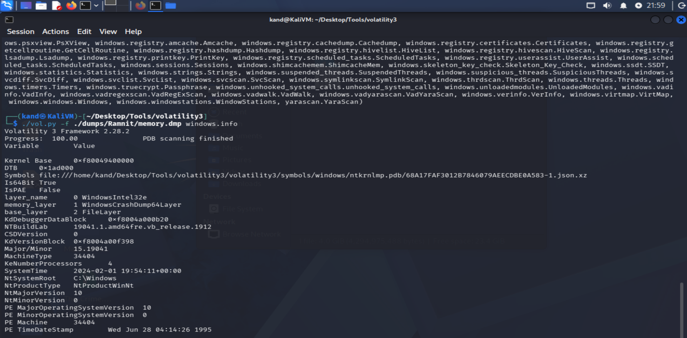
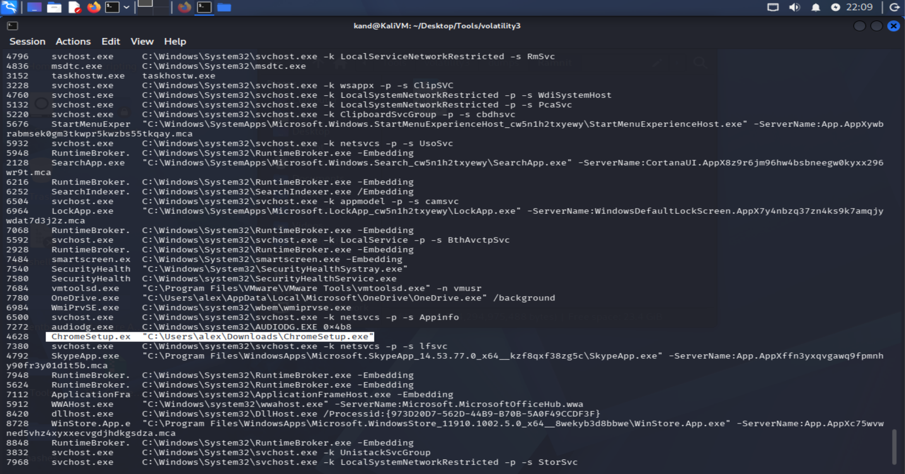
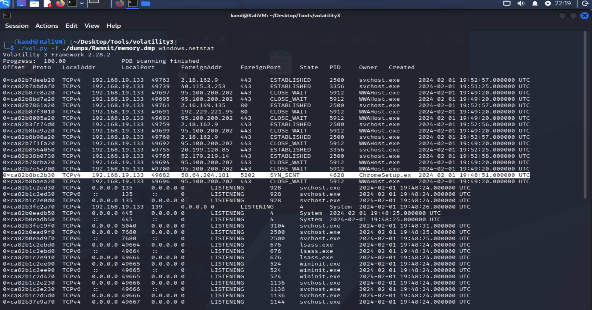
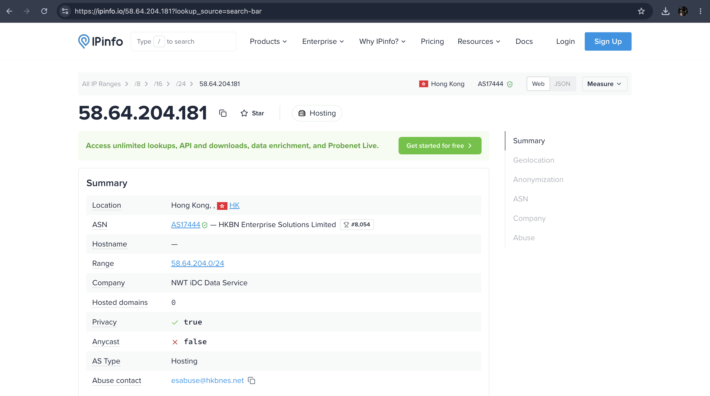
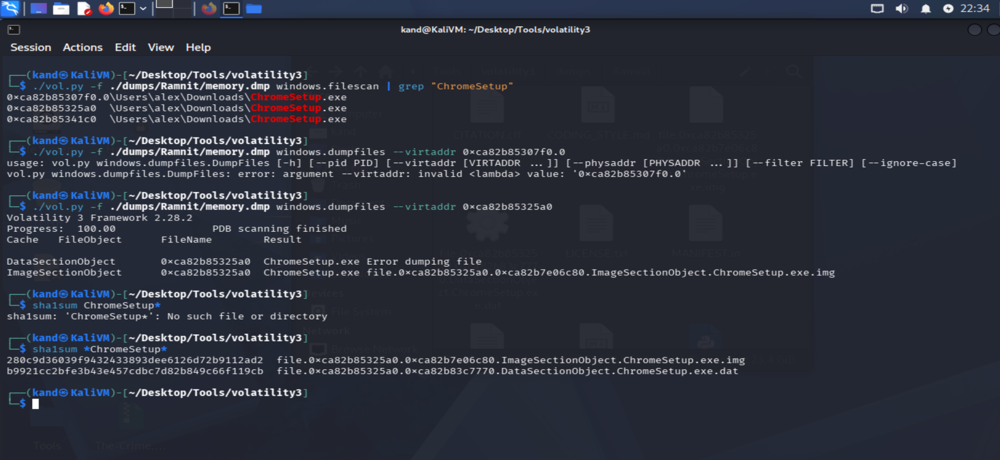
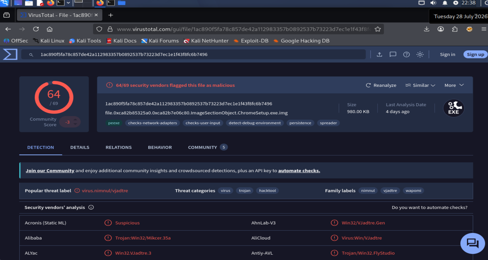
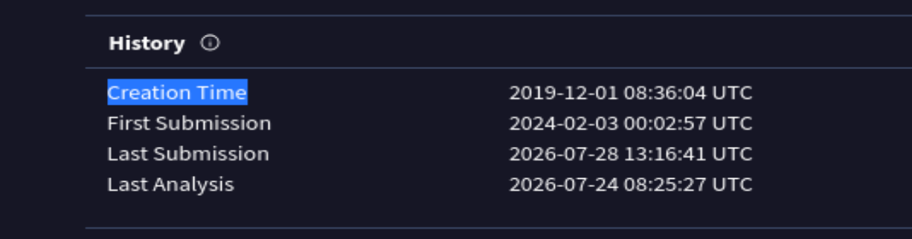
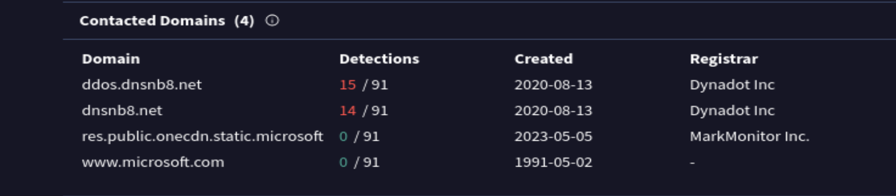

# Lab Title: Ramnit

**Platform:** Cyberdefenders

**Category:** Endpoint Forensic

---

## Objective

Analyze a memory dump using Volatility to identify a malicious process, extract network IOCs, file hash, and compilation timestamp, correlating with external threat intelligence.

---

## Skills Demonstrated

- Memory Forensics 

---

## Tools Used

- Volatility

---

## Methodology

As a first step, I identified the operating system from which the memory dump had been acquired. The analysis revealed that the target system was running Microsoft Windows.

Next, I searched for the process responsible for the suspicious activity. I initially reviewed the output of Volatility's **pslist**, but it did not provide enough information to continue the investigation. I therefore moved to the **cmdline** plugin, where I was able to inspect the command-line arguments of the running processes and identify a suspicious process execution.

Following the process analysis, I investigated the destination IP address that the suspicious process was communicating with.

To enrich the investigation, I applied threat intelligence by performing a geolocation lookup on the identified IP address.

The next step was to dump the malicious executable from memory in order to calculate its **SHA1** hash and analyze it using VirusTotal.

By reviewing the VirusTotal report, I was able to gather additional intelligence about the malware, including its creation timestamp and the domains used to establish communication with its infrastructure.

---

## Key Takeaways

- Memory forensics can reveal valuable artifacts such as running processes, command-line arguments, network connections, and malware samples without relying on disk-based evidence.
- Combining memory analysis with threat intelligence platforms such as VirusTotal helps enrich the investigation by identifying malware characteristics, associated infrastructure, and additional indicators of compromise.

---

## Real-World Relevance

Memory forensics tools such as **Volatility** enable analysts to recover valuable evidence directly from memory, supporting incident response even when disk artifacts are limited. Correlating forensic findings with **Threat Intelligence** further enriches the investigation by validating IOCs and identifying the malware's infrastructure and behavior.

