# Lab Title: Boogeyman 3

**Platform:** TryHackMe  

**Category:** SIEM investigation

---

## Objective

Investigate a simulated ransomware incident by analyzing security logs, identifying the attacker's techniques, extracting IOCs, and reconstructing the complete attack chain from initial execution to lateral movement and final payload deployment.

---

## Skills Demonstrated

- Incident Investigation
- Log Analysis
- Attack Chain Reconstruction 

---

## Tools Used

- ELK Stack

---

## Methodology

As a first step, I identified the PID of the process that executed the initial Stage 1 payload. I applied a filter using the name of the malicious file delivered through the phishing email and identified its parent process:

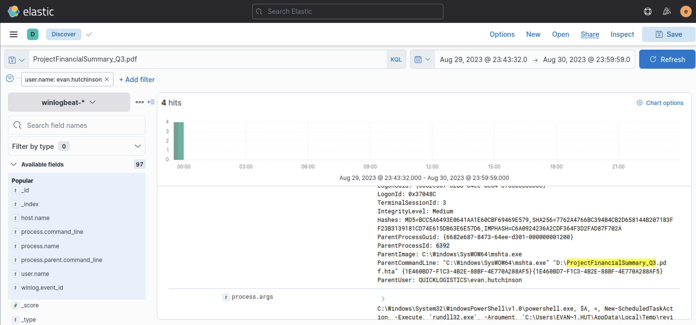

Next, I inspected the events related to the malicious file to better understand its behavior. During the analysis, I discovered that the Stage 1 payload attempted to implant a file into another location on the system:

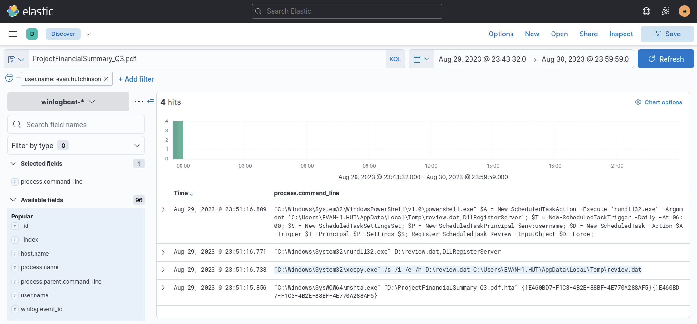

I then determined the execution of the malicious code, which was disguised as a legitimate Windows process using a **LOLBin** technique:

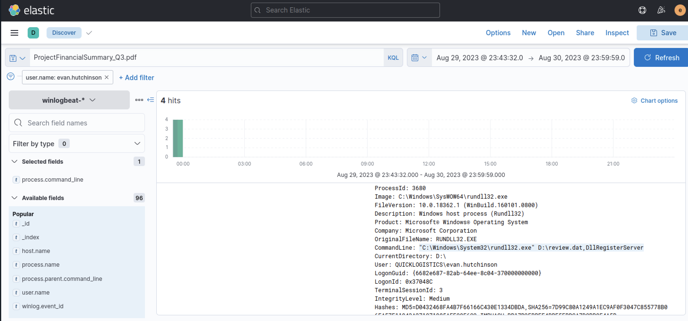

To identify persistence mechanisms, I searched for newly created scheduled tasks and found the malicious task created by the attacker:

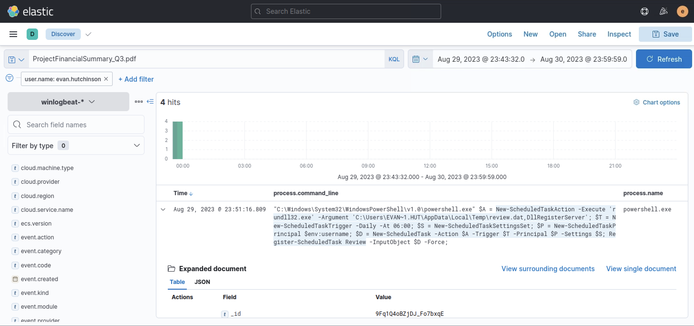

In the next step, I investigated potential **Command and Control** communications established by the malicious process and identified the destination IP address and port used for the connection:

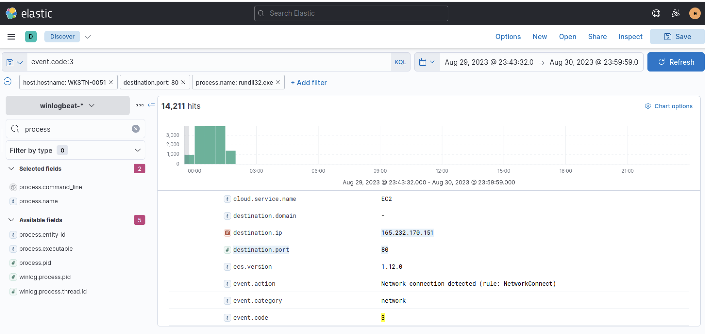

Looking for additional correlated activity related to the malicious **rundll32.exe** process, I observed the execution of **fodhelper.exe**, a binary commonly abused to perform a UAC bypass and achieve privilege escalation:

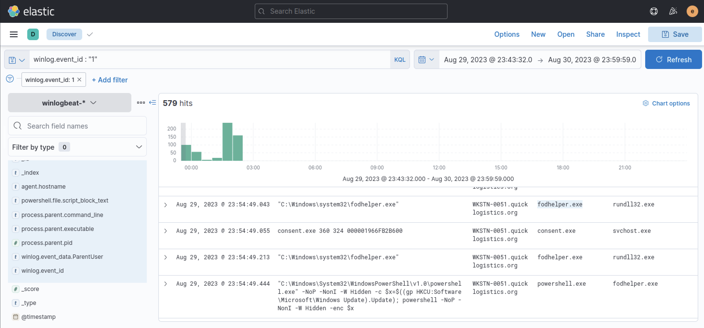

Continuing the investigation, I identified the tool used by the attacker to dump credentials from the compromised machine:

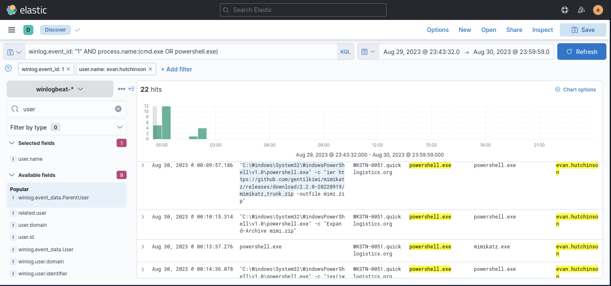

I then determined which user's credential hash had been extracted:

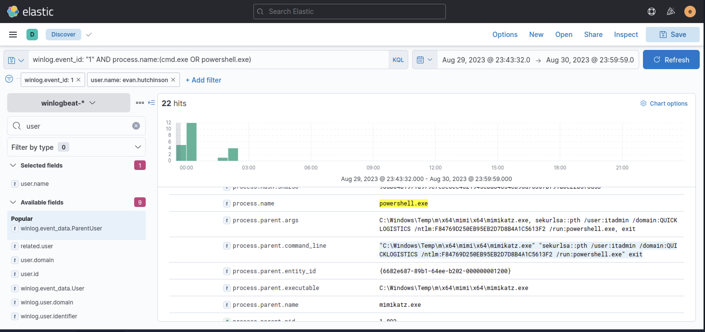

Continuing the analysis, I identified the file accessed by the attacker. After retrieving its contents, the attacker used the newly obtained credentials to perform lateral movement across the environment:

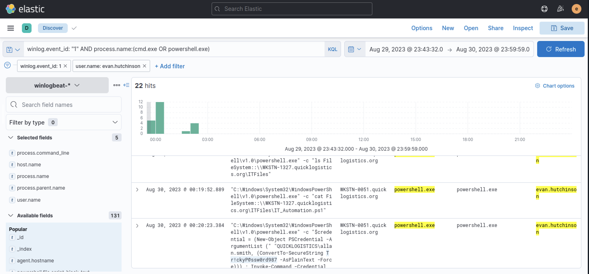

Following the attack chain, I identified the additional credential hashes dumped on the second machine, confirming that the attacker successfully obtained the password hash of the domain administrator:

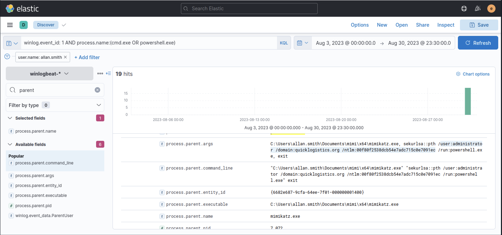

Finally, I identified the ransomware payload downloaded by the attacker from an external source and deployed after gaining access to the Domain Controller.

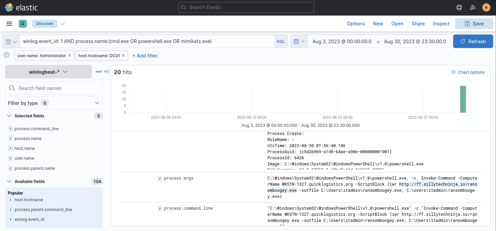

---

## Key Takeaways

- Attack chains should be analyzed as a whole rather than focusing on individual events. 
  Correlating process execution, persistence mechanisms, credential dumping, and lateral movement provided a complete understanding of the attack lifecycle.

- Living-off-the-Land techniques can significantly complicate threat detection. 
  Attackers can abuse legitimate Windows binaries such as **rundll32.exe** and **fodhelper.exe** to execute malicious code and bypass User Account Control while blending into normal system activity.

- Credential theft often represents a turning point in an intrusion.
  After successfully dumping credentials, attackers can perform lateral movement, compromise higher-privileged accounts, and escalate the impact of the attack, leading to events such as ransomware deployment.

---

## Real World Relevance

This investigation reflects real-world SOC and Incident Response activities, where analysts must correlate multiple sources of telemetry to reconstruct an attack timeline and understand the adversary's behavior.
The techniques observed in this scenario, including LOLBin abuse, UAC bypass, credential dumping, lateral movement, and ransomware deployment, are commonly used by real attackers during post-compromise operations.
Understanding these attack patterns allows security teams to improve detection capabilities, identify IOCs, map adversary activity to the MITRE ATT&CK framework, and implement effective defensive measures to reduce the impact of future incidents.
