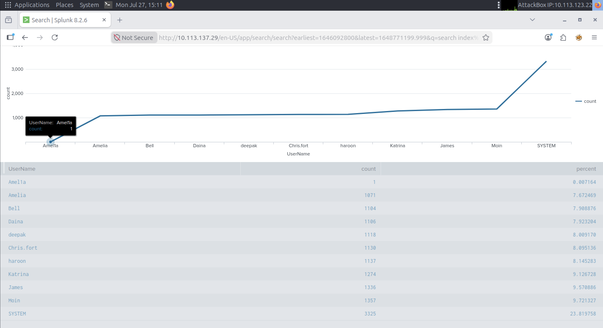
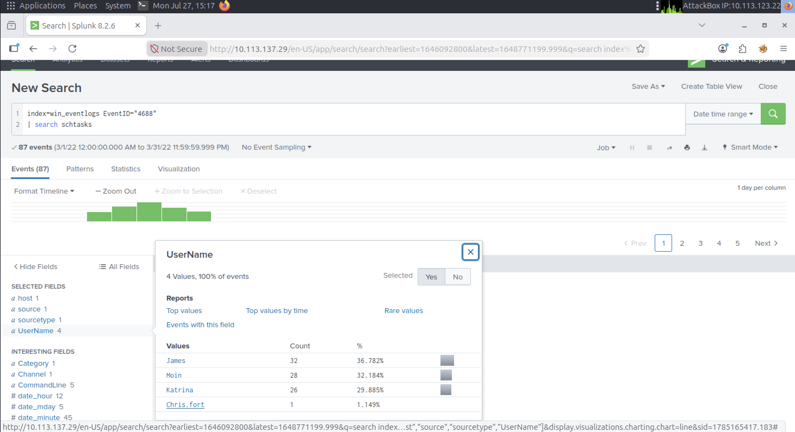
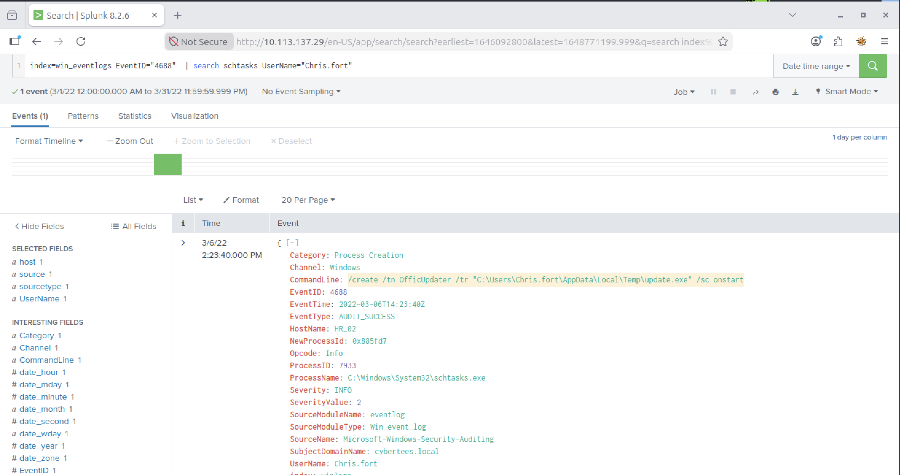
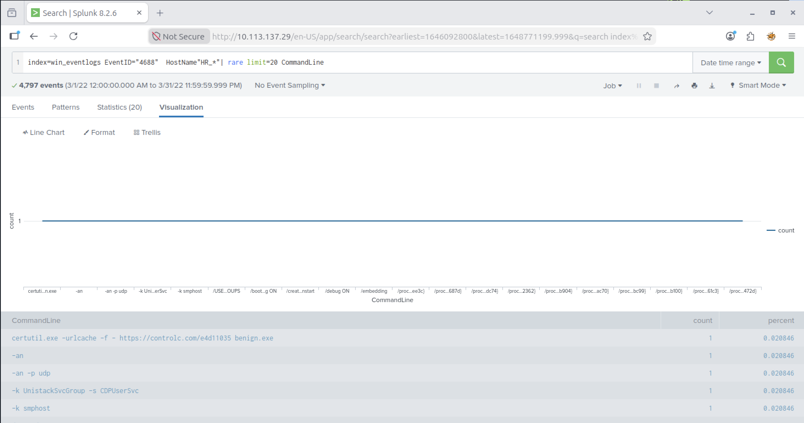
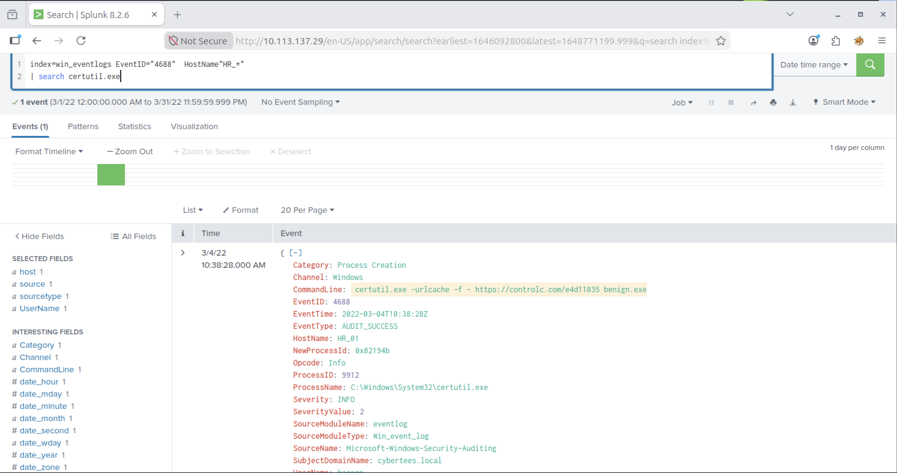

# Lab Title: Benign

**Platform:** TryHackMe  

**Category:** SIEM and Log Analysis

---

## Objective

We will investigate host-centric logs in this challenge room to identify suspicious activity and reconstruct the attack timeline.

---

## Skills Demonstrated

- SIEM investigation
- Log Analysis
- Incident investigation 

---

## Tools Used

- Splunk

---

## Scenario

One of the client’s IDS indicated a potentially suspicious process execution indicating one of the hosts from the HR department was compromised. Some tools related to network information gathering / scheduled tasks were executed which confirmed the suspicion. Due to limited resources, we could only pull the process execution logs with Event ID: 4688 and ingested them into Splunk with the index win_eventlogs for further investigation

## Methodology

As a first step, I configured the appropriate time range in Splunk to retrieve the events generated during the investigation period. The initial objective was to identify the presence of an imposter account by comparing the observed users against the list of legitimate company users.

The next phase focused on identifying the HR department user responsible for executing a scheduled task. By filtering the relevant Windows events, it was possible to determine which account had created and executed the scheduled task.

The investigation then shifted to identifying whether a **Living-off-the-Land Binary** had been abused to download an external payload. To support the analysis, I consulted the **LOLBAS Project** (`https://lolbas-project.github.io`) to identify legitimate Windows binaries commonly abused by attackers for payload delivery and post-exploitation activities.

By analyzing the last filtered event, it was possible to determine when the LOLBIN was executed, identify the third-party file-sharing service contacted by the compromised host, recover the downloaded filename, and reconstruct the complete URL used during the post-exploitation phase.

---

## Key Takeaways

- Effective SIEM investigations rely on narrowing the scope of analysis through time ranges, event filtering, and targeted SPL queries.
- Windows Event Logs can reveal attacker behavior by exposing process execution, scheduled tasks, and user activity.
- Legitimate Windows binaries can be abused to download malicious payloads, making contextual log analysis essential for detection.

---

## Real-World Relevance

This investigation reflects a common SOC analyst workflow, where SIEM platforms are used to analyze Windows event logs, identify suspicious user activity, detect the abuse of legitimate system utilities, and reconstruct attacker actions to support incident response.
