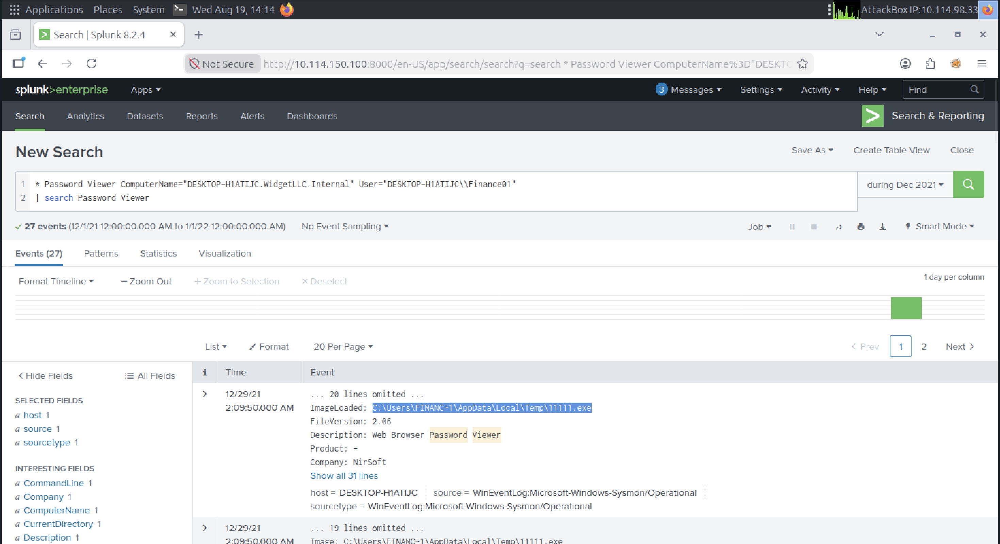
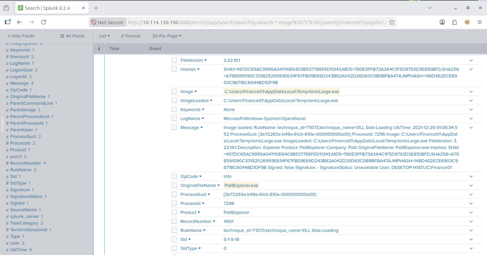
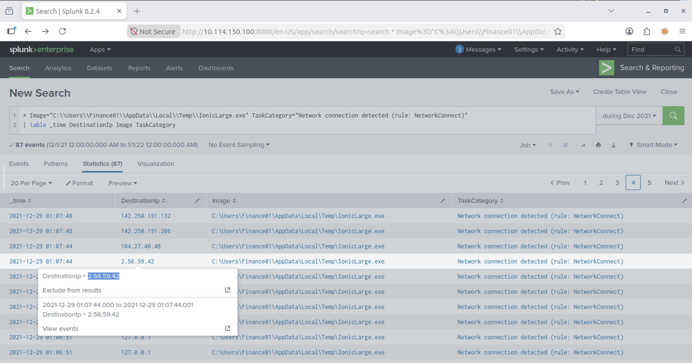
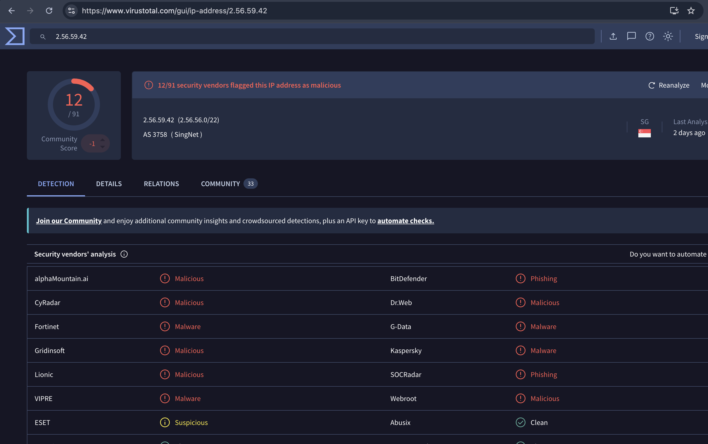
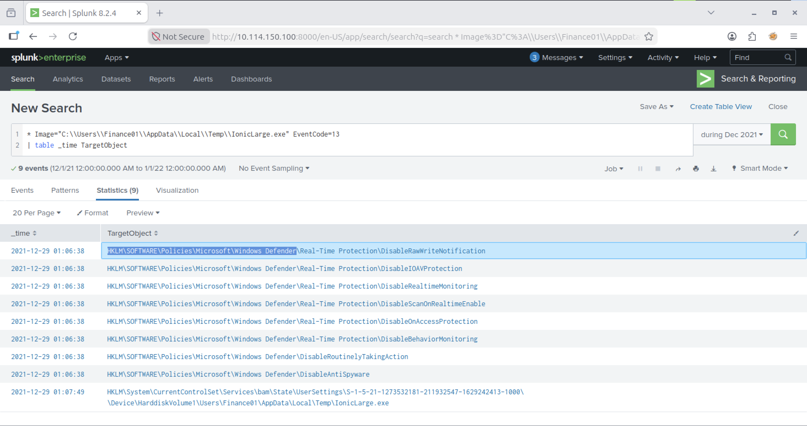
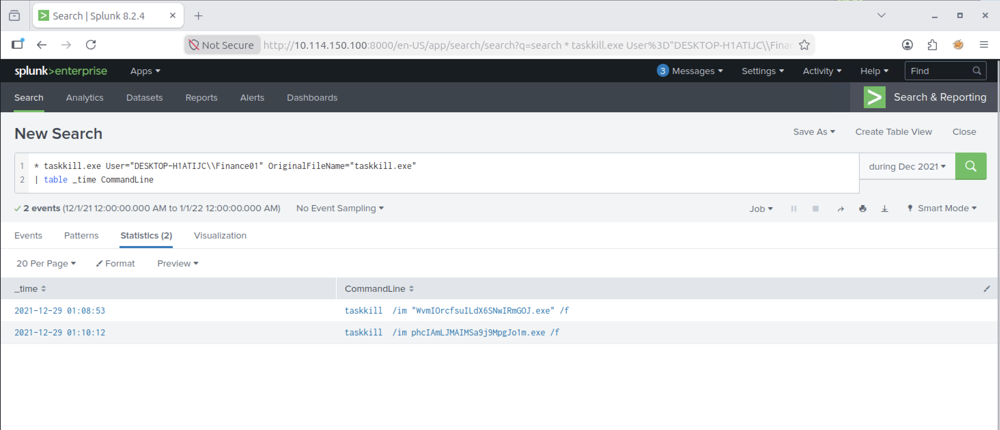
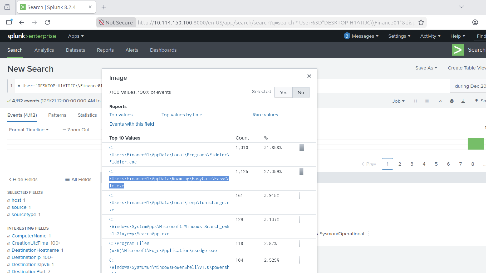
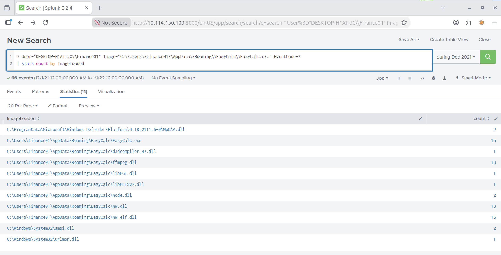

# Lab Title: New Hire Old Artifacts

**Platform:** TryHackMe  

**Category:** SIEM  

---

## Objective

Investigate historical endpoint activity in Splunk to identify suspicious binaries, malicious behavior, and potential Indicators of Compromise.

---

## Skills Demonstrated

- Endpoint Log Analysis & Threat Investigation

---

## Tools Used

- Splunk

---

## Scenario

You are a SOC Analyst for an MSSP (managed Security Service Provider) company called TryNotHackMe.

A newly acquired customer (Widget LLC) was recently onboarded with the managed Splunk service. The sensor is live, and all the endpoint events are now visible on TryNotHackMe's end. Widget LLC has some concerns with the endpoints in the Finance Dept, especially an endpoint for a recently hired Financial Analyst. The concern is that there was a period (December 2021) when the endpoint security product was turned off, but an official investigation was never conducted. 

Your manager has tasked you to sift through the events of Widget LLC's Splunk instance to see if there is anything that the customer needs to be alerted on. 

## Methodology

As a first step, I adjusted the time and date range in Splunk to match the timeframe required for the investigation. I then identified the binary used for Web Browser Password Viewer, including its full path on the infected host and the associated company name:

Next, I parsed the logs to identify whether other binaries had been executed from the same directory as the previously identified file. I spotted another suspicious executable and identified its original filename:

I then identified the IP address that the suspicious executable established a connection with:

I confirmed the malicious reputation of the IP address by checking available reports on VirusTotal:

Continuing the investigation, I analyzed the registry activity generated by the malicious executable to identify which registry paths had been modified:

I then identified several processes that had been terminated using `taskkill`, along with the associated binaries being deleted:

By analyzing the malware's behavior, I identified several PowerShell commands aimed at modifying Windows Defender settings as an evasion technique. This activity is associated with the **Impair Defenses** technique in MITRE ATT&CK:

**MITRE ATT&CK: T1685 – Impair Defenses: Disable or Modify Tools**

I also identified another malicious binary that was executed on the infected workstation from a different `AppData` location:

Finally, after identifying the additional malicious executable, I investigated the DLLs loaded by the process:

---

## Key Takeaways

- Learned how to correlate endpoint events in Splunk to reconstruct malicious activity and identify multiple stages of an attack.

---

## Real-World Relevance

Similar investigations help SOC analysts identify suspicious endpoint activity, validate IOCs, and detect defense evasion techniques during incident response.
