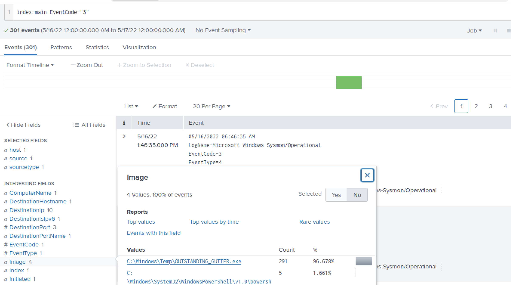
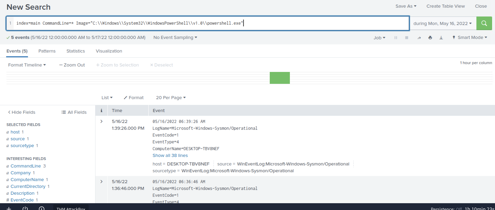
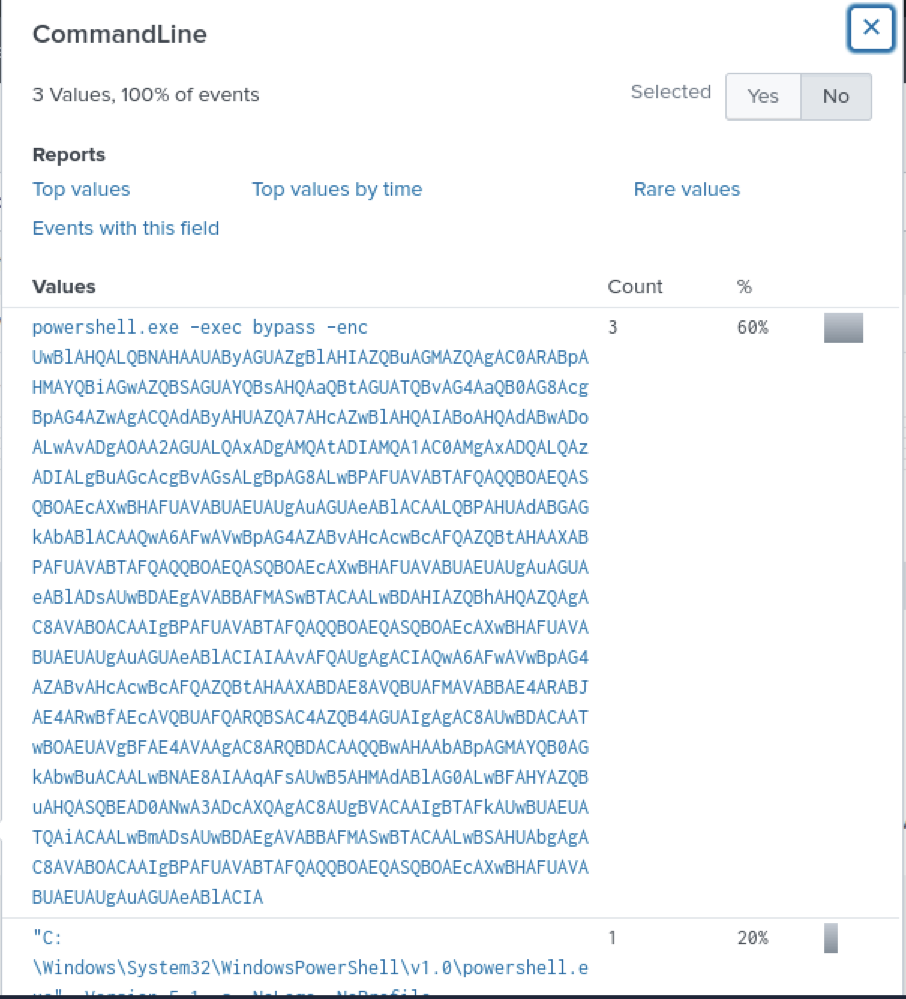
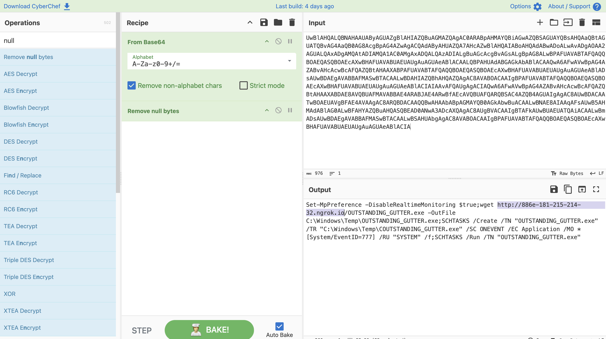
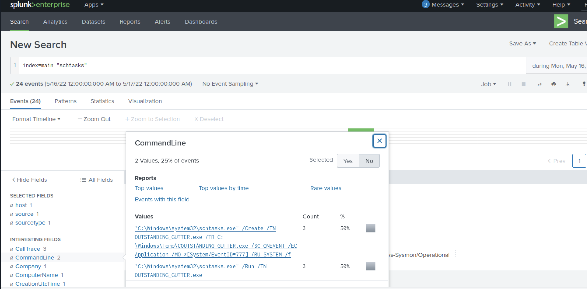
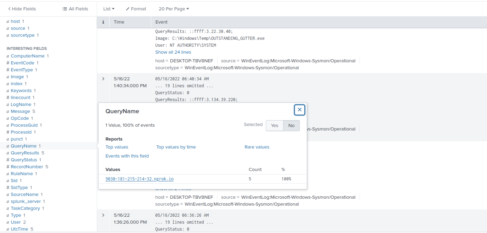
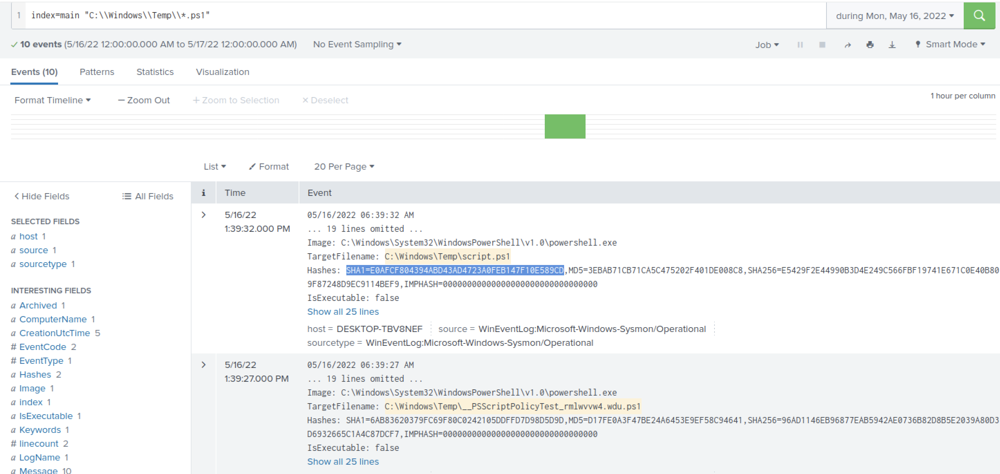
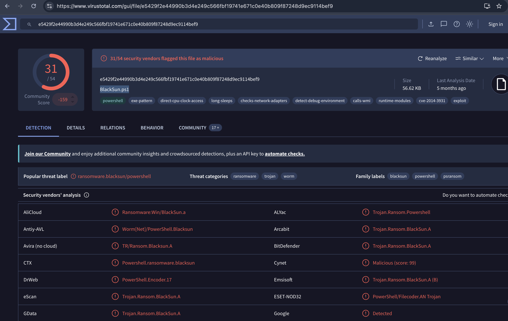
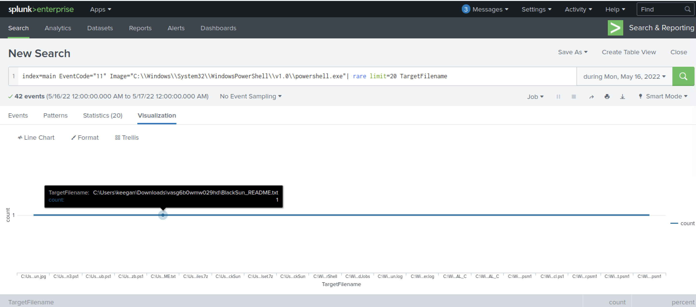
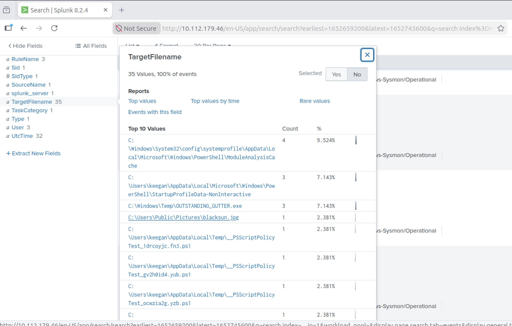

# Lab Title: PS Eclipse

**Platform:** TryHackMe 
 
**Category:** Incident Investigation 

---

## Objective

- Investigate the activity of a suspected ransomware infection by analyzing system and network logs to identify the attack chain, malicious activity, and relevant Indicators of Compromise (IOCs).

---

## Skills Demonstrated

- Log Analysis & Event Correlation
- PowerShell Scripts Analysis

---

## Tools Used

- Splunk

---

## Scenario

You are a SOC Analyst for an MSSP (Managed Security Service Provider) company called TryNotHackMe .

A customer sent an email asking for an analyst to investigate the events that occurred on Keegan's machine on Monday, May 16th, 2022 . The client noted that the machine is operational, but some files have a weird file extension. The client is worried that there was a ransomware attempt on Keegan's device. 

Your manager has tasked you to check the events in Splunk to determine what occurred in Keegan's device

## Methodology

First, I parsed the logs to identify network connections using Sysmon Event ID 3. This allowed me to spot the suspicious `.exe` file involved in the communication:

Next, I followed the process activity to identify the URL from which the suspicious executable had been downloaded. I parsed the logs looking for potentially malicious PowerShell activity:

I found an encoded PowerShell script, which I decoded using CyberChef:

By analyzing the decoded script, I identified that it was designed to create a new scheduled task on the operating system. I then parsed the logs looking for `schtasks` activity correlated with the suspicious file:

To determine whether the malicious file was communicating with a remote server, I filtered the DNS queries associated with the malicious file and identified the remote server address:

Next, I looked for other PowerShell scripts stored in the same location as the previously identified script:

I compared the SHA1 hash of the script against VirusTotal to identify the actual name of the malicious file:

A ransomware note was also saved to disk, which can be used as an IOC. I searched the Sysmon logs using Event ID 11 to identify the file creation activity:

Finally, I identified another IOC: an image file that had been saved to disk and used to replace the user's desktop wallpaper:

---

## Key Takeaways

- Improved my understanding of ransomware behavior by analyzing how malicious PowerShell scripts, scheduled tasks, network connections, and file creation activities can be used together as part of the attack chain.

---

## Real-World Relevance

- This type of analysis reflects real-world SOC investigations, where analysts correlate endpoint, PowerShell, DNS, and file-creation events to reconstruct ransomware activity, identify IOCs, and support incident response.
