# Lab Title: Lockdown Lab

**Platform:** CyberDefenders

**Category:** Network Analysis / Memory Dump Analysis / Malware Analysis

---

## Objective

Perform a multi-stage forensic investigation combining **network traffic analysis, memory dump analysis, and basic malware analysis** to reconstruct the attack chain, identify the persistence mechanism, and investigate the malware's C2 infrastructure.

---

## Skills Demonstrated

* Network Traffic Analysis
* Memory Dump Analysis
* Basic Malware Static Analysis
* Threat Intelligence and IOC Investigation
* Attack Chain Reconstruction

---

## Tools Used

* Wireshark
* TShark
* Volatility 3
* Ghidra
* VirusTotal
* MalwareBazaar

---

## Methodology

### 1st Stage: Network Analysis

In the first stage of the lab, I analyzed a *PCAP* file containing malicious network traffic.

As a first step, I needed to identify where the malicious traffic was coming from. To spot the suspicious IP, I checked the *Conversations* statistics in Wireshark. I noticed a high volume of packets exchanged between `10.0.2.4` and `10.0.2.15`. I then filtered the traffic between these two IPs and identified `10.0.2.4` as the suspicious IP:

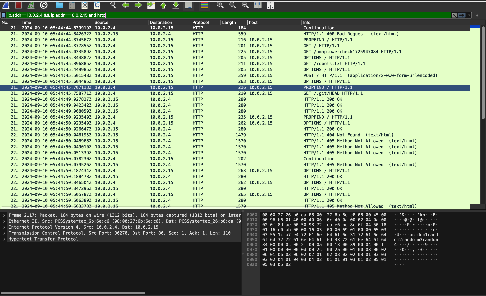

The attacker was performing enumeration against the victim's HTTP service. I then identified which tool was being used for this activity by using the filtering capabilities of *TShark*:

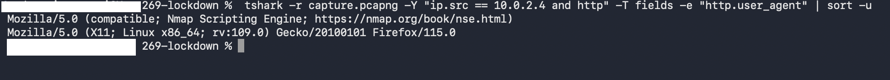

I then moved on to the SMB traffic to identify which share paths were accessed by the attacker. Again, I used TShark to quickly extract the full UNC paths accessed during the SMB activity:

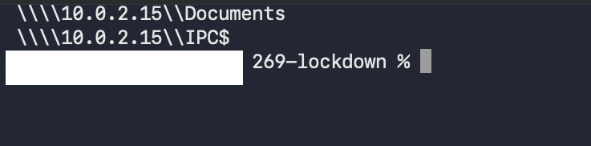

The attacker then uploaded a web-accessible payload that could be used to achieve remote code execution. I identified the uploaded file by looking for *Create Request* and *Write Request* activity in the SMB2 traffic:

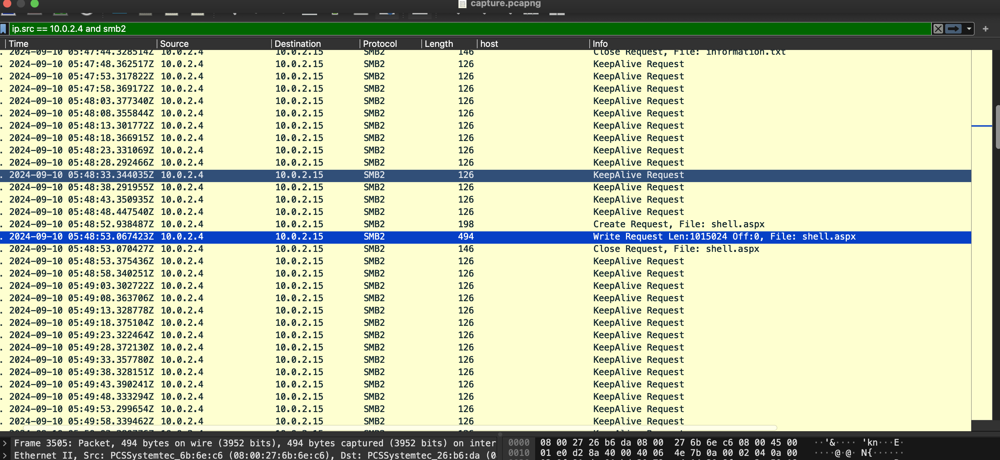

The newly uploaded file activated a reverse shell, generating outbound traffic towards the attacker's IP. I identified the uncommon but firewall-friendly port used for this communication: **4443**.

Port 4443 is a non-standard port that is sometimes used as an alternative to port 443, including for HTTPS-related traffic:

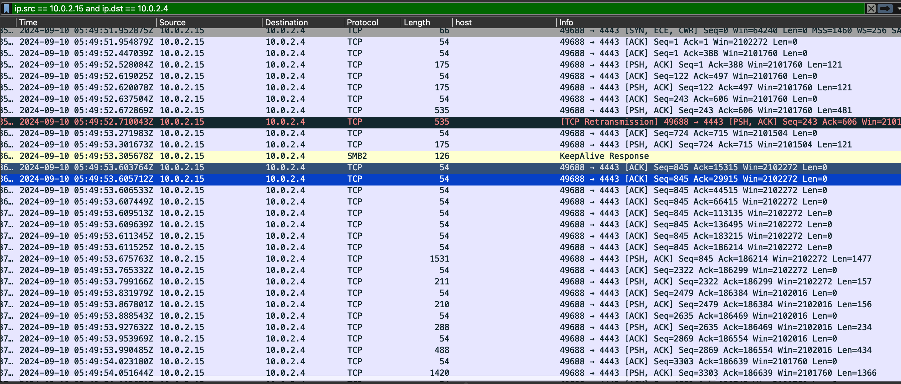

---

### 2nd Stage: Memory Dump Analysis

In the second stage of the lab, I proceeded with the analysis of the memory dump using *Volatility 3*.

As a first step, I identified the kernel base address in the memory dump, providing important context for the subsequent memory analysis:

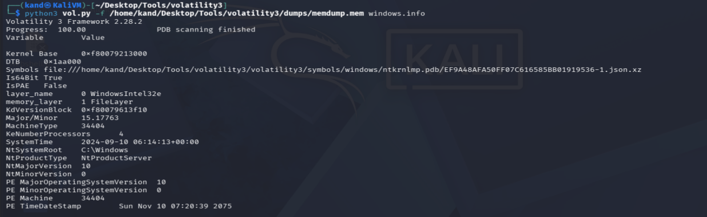

Next, I needed to identify the persistence mechanism. I started by listing the active processes from the memory dump using the `windows.pslist` plugin. Among the running processes, I spotted `updatenow.exe`, which does not match a standard Windows process name and therefore required further investigation.

I then determined the on-disk location of this executable using the `windows.filescan` plugin. The executable was located in the Windows *Startup Folder*, meaning it could be configured to execute automatically when a user logs on.

This persistence technique maps to **MITRE ATT&CK T1547.001 — Boot or Logon Autostart Execution: Registry Run Keys / Startup Folder**:

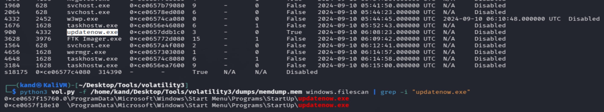

In the final step of the memory dump analysis, I needed to determine which process was responsible for the reverse shell's outbound traffic.

Since I already knew the destination port used by the reverse shell from the PCAP analysis, I filtered the network connections and identified the relevant process by combining the `windows.netscan` plugin from Volatility 3 with the filtering capabilities of `grep`:

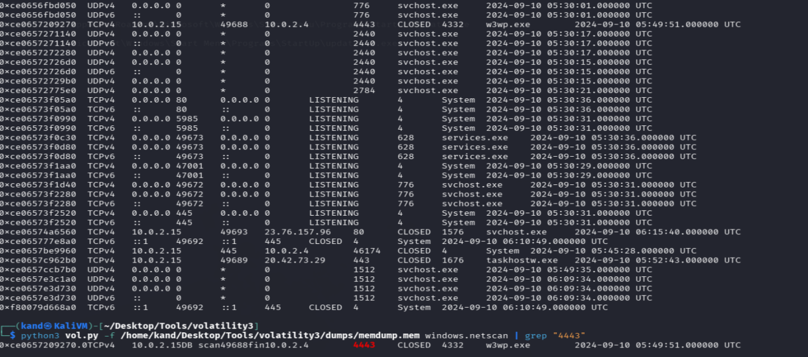

---

### 3rd Stage: Malware Analysis / Threat Intelligence

I then performed a basic static analysis of the malware sample. The analysis indicated that the sample had been packed, which can make static analysis more difficult.

To identify the packer used, I inspected the binary's memory map in *Ghidra* and identified **UPX** as the packer:

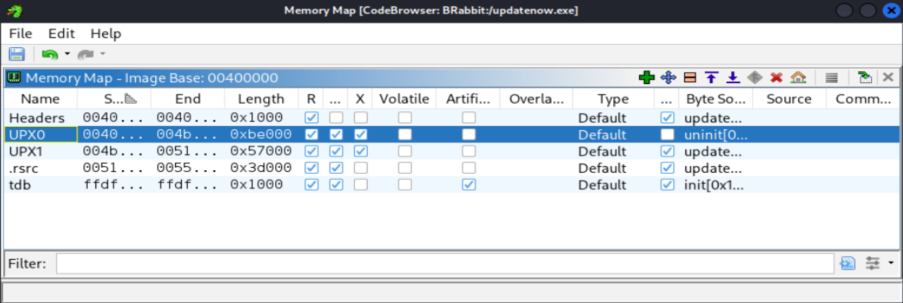

> **Note:** For this specific task, checking the binary with `strings` could also provide enough information to identify the packer.

I then analyzed the malware sample with *VirusTotal* to identify the FQDN contacted by the malware for C2 communication.

The **SMTP Communications** and **DNS Resolutions** sections both referenced the domain `cp8nl.hyperhost.ua`, indicating that the malware resolves and communicates with this host:

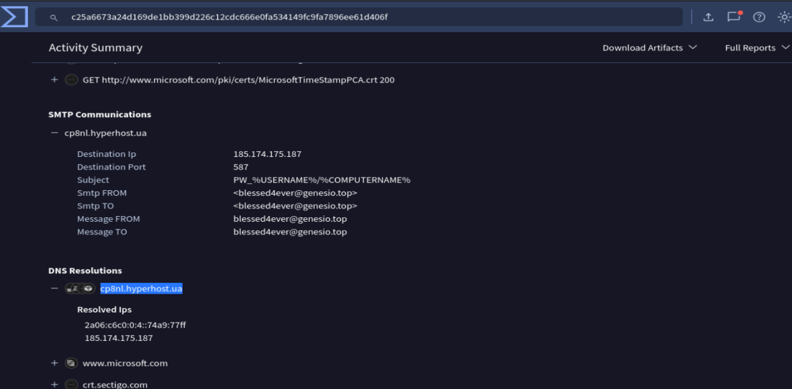

As the final step, I needed to identify the RAT family associated with the malware's **SHA256 hash**.

The SHA256 hash can be retrieved from the VirusTotal report or calculated locally using:

```bash
sha256sum <malware_file>
```

I then submitted the SHA256 hash to *MalwareBazaar*, which identified the sample as belonging to the **Agent Tesla** RAT family.

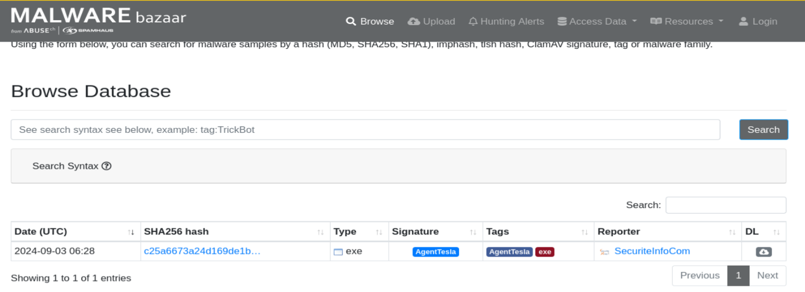

---

## Key Takeaways

* Correlating **network traffic, memory artifacts, and malware intelligence** provides a more complete picture of an intrusion.
* Process analysis and file-system artifacts can reveal **persistence mechanisms** that are not immediately visible from network traffic alone.
* Tools such as **Wireshark, TShark, Volatility 3, VirusTotal, and MalwareBazaar** can be combined to move from an initial network indicator to the related process, file, C2 infrastructure, and malware family.

---

## Real-World Relevance

The techniques practiced in this lab are directly applicable to **SOC, DFIR, and threat investigation workflows**.

In a real-world investigation, analysts may need to correlate network indicators with endpoint and memory artifacts, identify persistence mechanisms, investigate suspicious binaries, and enrich IOCs using threat intelligence sources.

The lab also demonstrates the importance of **pivoting between different sources of evidence** rather than relying on a single artifact when investigating a potential compromise.
