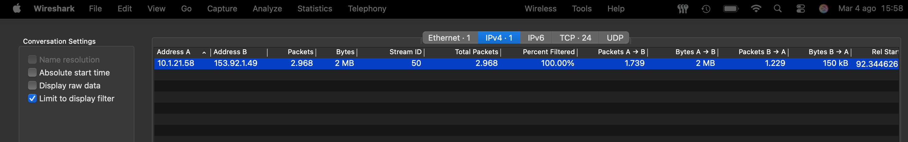
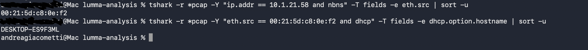
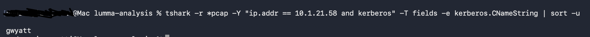
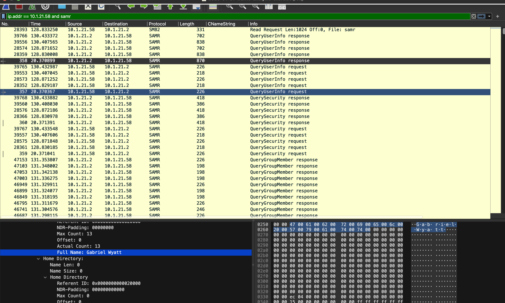
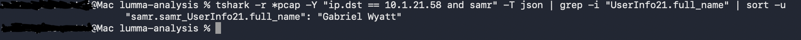
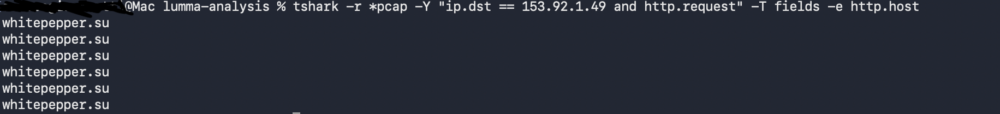
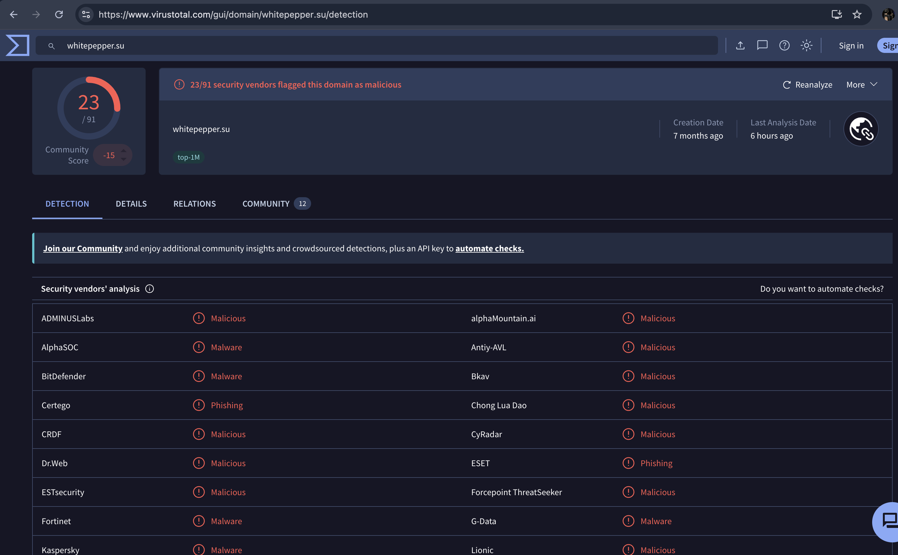
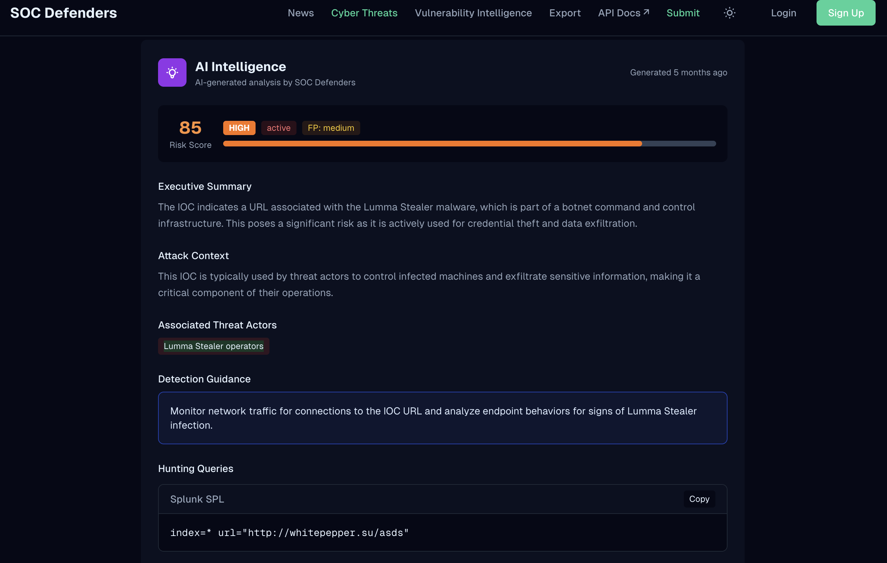
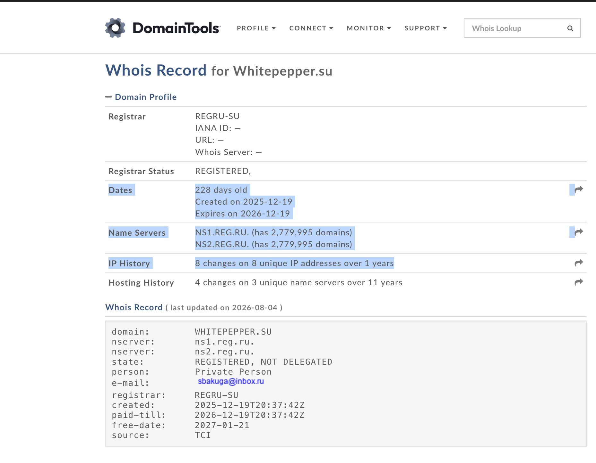

# Lab Title: Lumma in the Room-ah!

**Platform:** Malware-Traffic-Analysis.net

**Category:** Network Analysis

---

## Objective

Analyze a network packet capture associated with a Lumma Stealer infection to identify the compromised host, extract key Indicators of Compromise, attribute the activity to the affected user, and validate the findings using external threat intelligence sources.

---

## Skills Demonstrated

- Network and Malware Traffic Analysis

---

## Tools Used

- Wireshark
- TShark

---

## Scenario

As an analyst at a Security Operations Center (SOC), you check alerts for the past week
and find a signature hit for ET MALWARE Lumma Stealer Victim Fingerprinting
Activity that triggered on traffic from 153.92.1[.]49 over TCP port 80. The alert
triggered on 2026-01-27 at 23:05 UTC.
Using the information, you retrieve a packet capture (pcap) of the traffic from the internal IP
address that triggered the alert. Based on the pcap, you write up an incident report, so the
incident responders can track down the computer and associated user.

## Methodology

As a first step, I isolated the suspicious traffic to identify which internal IP address was communicating with the malicious external IP. I used the **Statistics** feature after i applied the filter for the suspicious IP in Wireshark to get a clearer overview of the communication and identify the infected host:

Then, I used TShark filtering capabilities to quickly retrieve additional information about the victim machine, including the MAC address and the hostname of the client:

To identify the username associated with the infected host, I applied a TShark filter on Kerberos packets and analyzed the **CNameString** field to retrieve the user account involved in the communication:

Finally, I identified the full name of the user associated with the infected host by analyzing SAMR packets. Initially, I performed a manual analysis because it was easier to locate the required information:

Afterwards, I researched a more efficient way to extract this information using TShark. I discovered that using the **-T json** flag allows network packets to be converted into structured and readable output, making it easier to search for specific fields such as **full_name** without manually identifying the required syntax:

As the final step, I identified the domain name responsible for triggering the **ET MALWARE Lumma Stealer Victim Fingerprinting Activity** alert. I used a TShark filter to quickly isolate the malicious host involved in the communication:

I then correlated the collected findings with external threat intelligence and OSINT resources to validate the malicious domain and gather additional information about the infrastructure:

---

## Key Takeaways

- Network traffic alone can reveal valuable information about a compromise.
  Even without endpoint access, packet captures can be used to identify infected hosts, user accounts, and malicious communications.

- Command-line tools such as TShark can significantly speed up network investigations.
  Applying targeted filters allows analysts to efficiently extract relevant artifacts from large PCAP files.

---

## Real World Relevance

Network traffic analysis is a fundamental capability for SOC analysts and incident responders, especially when investigating malware infections or suspicious network activity. Packet captures often provide critical evidence when endpoint telemetry is unavailable or incomplete.

The techniques used in this investigation, including PCAP analysis, IOC extraction, user attribution, and threat intelligence correlation, are commonly performed during real-world incident response to identify compromised systems, understand attacker infrastructure, and support containment and remediation efforts.
