# Lab Title: Checkmate

**Platform:** TryHackMe  

**Category:** Password Security

---

## Objective

Perform a password security assessment by identifying weak authentication practices through password auditing and credential attacks.

---

## Skills Demonstrated

- Password Security Assessment
- Password Cracking
- Custom Wordlist Generation

---

## Tools Used

- Hydra
- CUPP
- Crunch

---

## Scenario

Marco Bianchi, a systems administrator, recently deployed several internal services, including a firewall console, employee portal, social platform, and SSH access to critical infrastructure. Due to tight deadlines and operational pressure, Marco reused weak, predictable, and pattern-based passwords across multiple systems. 

> **Note:** You may notice that the target IP address changes between some screenshots. This is because the challenge was completed across two different sessions on the same day. Since the target machine was redeployed between sessions, it was assigned a different IP address. The investigation process and results remain unchanged.

## Methodology

The first level of the lab presented a firewall login page running on port **5001**, where the administrator had left the default credentials unchanged. I began by analyzing the login request in order to correctly configure **Hydra**, using the **rockyou.txt** wordlist. Once the attack was launched, I successfully identified the weak password.

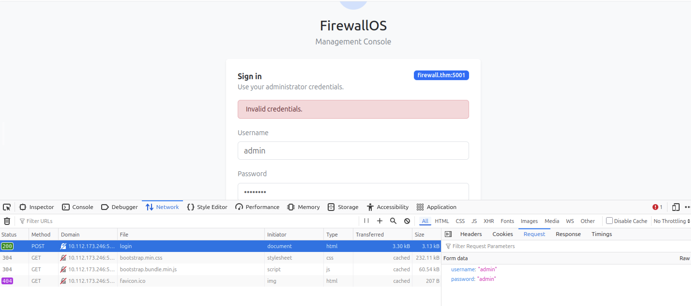
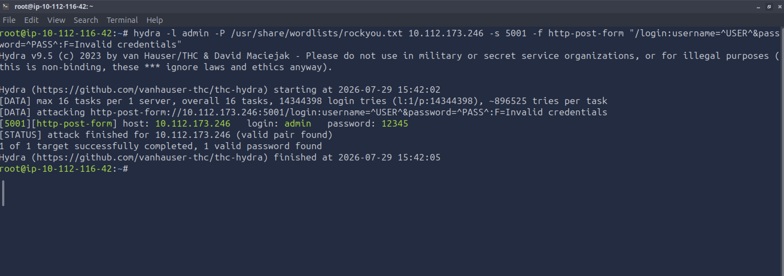

The second level consisted of an internal Employee Login portal running on port **5002**. The lab hinted that employees commonly used company-related keywords as passwords. I first analyzed the webpage and immediately identified several recurring company terms that could potentially be used as credentials.

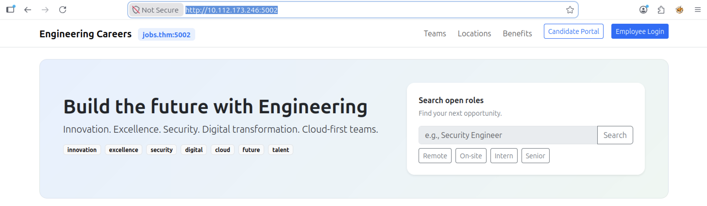

After testing these keywords, I successfully identified the correct password.

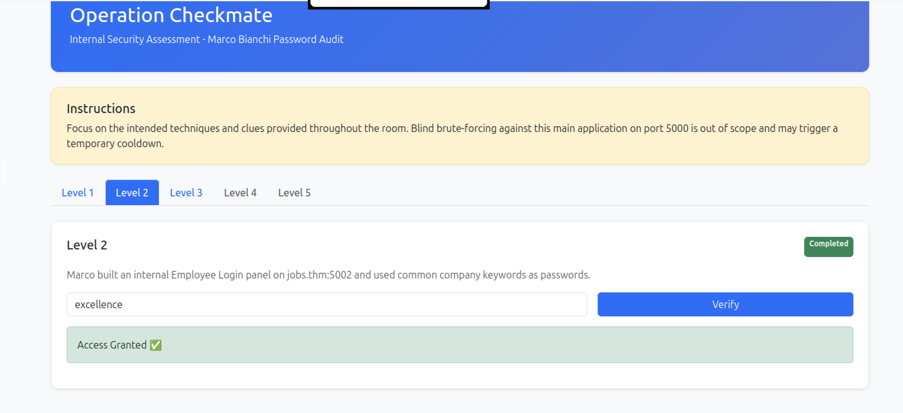

The third level required retrieving the user's password by leveraging personal information about the victim. I collected relevant details from the employee portal accessed in the previous level.

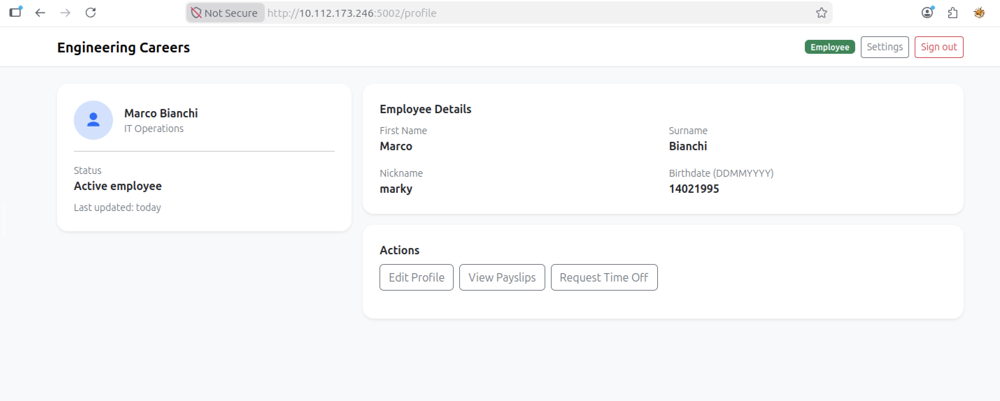

Using the collected information, I generated a customized wordlist with **CUPP (Common User Passwords Profiler)**.

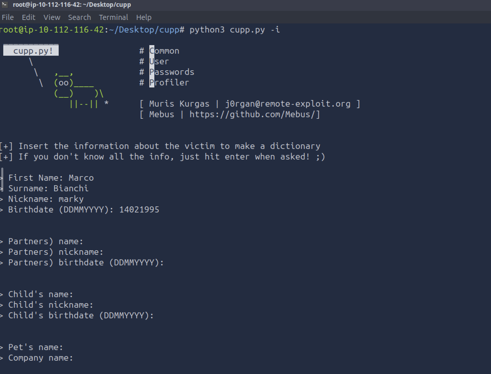

I then used the generated wordlist together with **Hydra** to perform a password attack and successfully recover the user's credentials.

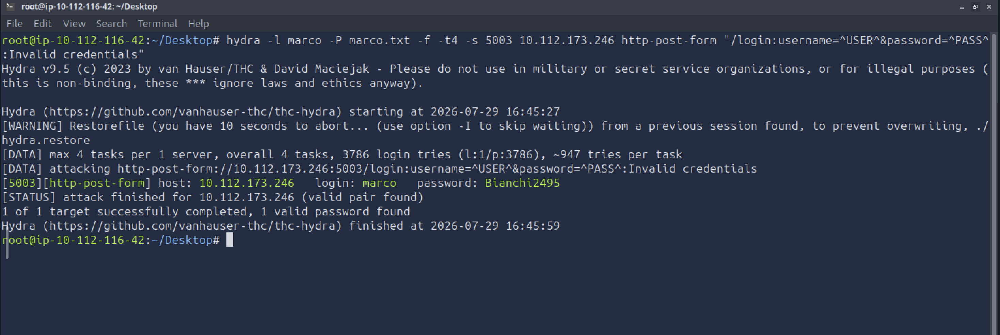

In the fourth level, the lab explained that the user had recently uploaded a new profile picture. For privacy and storage consistency, the platform automatically renamed uploaded files using the **SHA256 hash** of the original filename, storing them as **(SHA256).png**. The objective was to recover the original filename.

I first extracted the SHA256 hash by inspecting the page source.

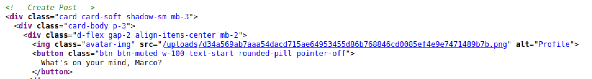

Since the value appeared to be a raw SHA256 hash, I initially queried an online hash database, which quickly returned the original filename.

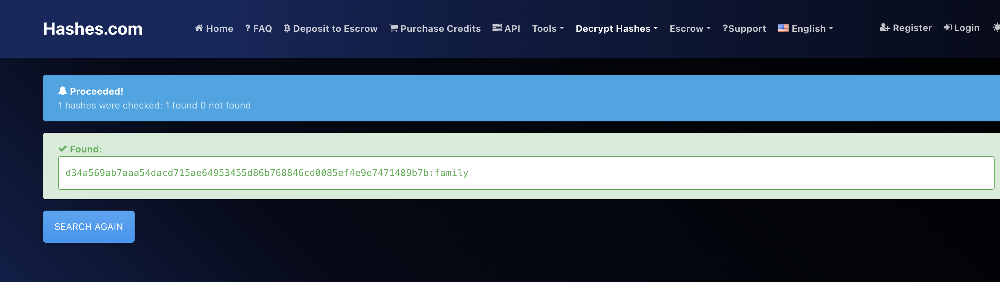

As an alternative approach, I also demonstrated how the same result could be achieved using **John the Ripper**.

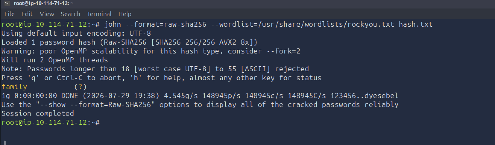

The final level required creating a custom wordlist based on a known password pattern in order to gain SSH access to the target system. A comment left by the user on the employee portal revealed the password structure: **a capitalized company keyword, followed by a year and an exclamation mark**. Based on this information, I generated a tailored wordlist using **Crunch**.

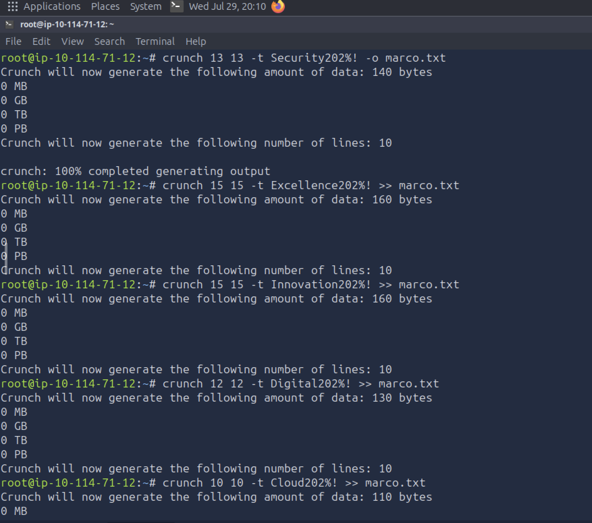

Finally, I launched a password attack against the SSH service using **Hydra** together with the generated wordlist, successfully recovering the user's password.

---

## Key Takeaways

- Weak passwords often originate from predictable patterns such as default credentials, company-related keywords, or personal information.
- Custom wordlists built from OSINT and user profiling significantly increase the effectiveness of password attacks.
- Password security assessments help identify weak authentication practices before they can be exploited by attackers.

---

## Real-World Relevance

Password security assessments are routinely performed during penetration tests and internal security audits to identify weak credentials. Understanding password attack techniques also helps defenders improve password policies, implement MFA, and reduce the risk of credential-based attacks.
